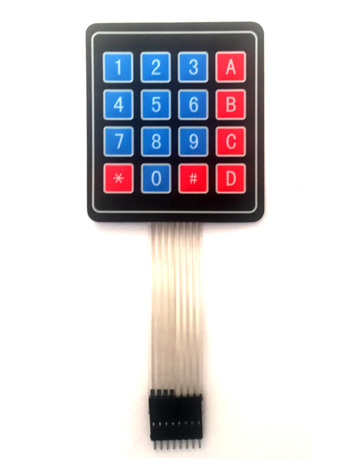
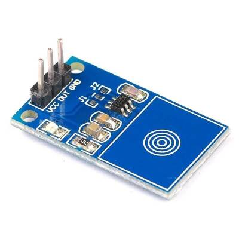

# kapi
PFAL Robotik sınıfının kapısı için gerekli kod ve teknik döküman

## Malzemeler
Kapı için gerekli malzemeler:
* Arduino UNO
* Bir adet 4x4 keypad (ZRX-543)
* TTP223 dokunmatik sensör
* Elektromıknatıs kilit

  
Pinler soldan sağa sırasıyla `R1`, `R2`, `R3`, `R4`, `C1`, `C2`, `C3`, `C4`

  
Pinler:
| Modüldeki ismi | Açıklaması |
| -------------- | ---------- |
| `VCC` | Pozitif gerilim pini |
| `OUT` | `RELAY_PIN` pini |
| `GND` | Negatif gerilim pini |

<!-- buraya selenoid'in fotografi ve pin aciklamalari gelecek -->

## Pinler
| Adı | Açıklaması | Arduino üzerindeki karşılığı |
| --- | ---------- | ---------------------------- |
| `R1` | Keypad satır pini 1 | `13` |
| `R2` | Keypad satır pini 2 | `12` |
| `R3` | Keypad satır pini 3 | `11` |
| `R4` | Keypad satır pini 4 | `10` |
| `C1` | Keypad sütun pini 1 | `9` |
| `C2` | Keypad sütun pini 2 | `8` |
| `C3` | Keypad sütun pini 3 | `7` |
| `C4` | Keypad sütun pini 4 | `6` |
| `RELAY_PIN` | Elektromıknatıs kilidin pini | `2` |
| `TOUCH_PIN` | Dokunmatik sensörün pini | `3` |

## Devre düzeni
Kapının sınıfın içine bakan tarafında Arduino, Arduino'nun güç kaynağıyla bağlantısı ve elektromıknatıs kilidin kendi güç kaynağı bulunur, ayrıca bunlar arasındaki kablolama da buradadır. Kapının sınıfın dışına bakan tarafında Keypad bulunur, gerekli kablolama kapının deliğinden arka tarafa geçer.